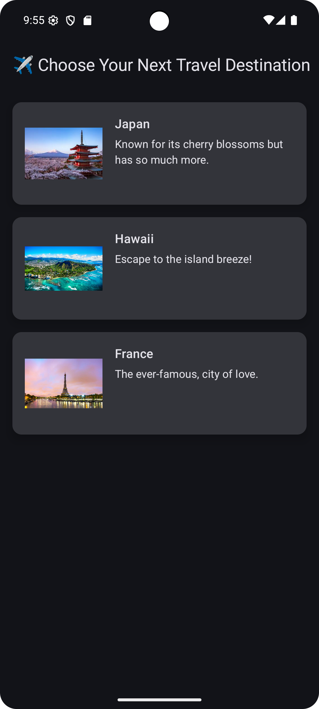
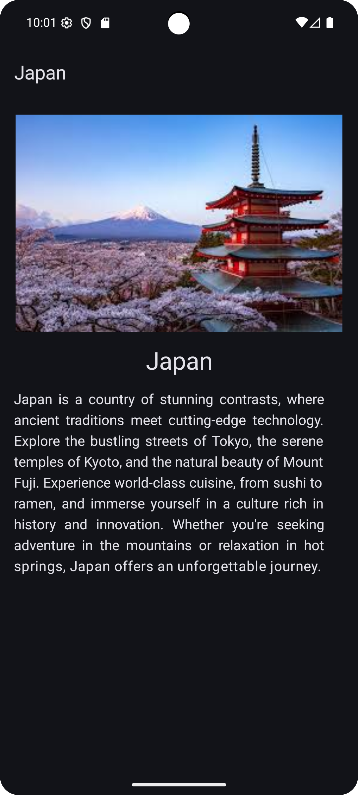

# Travel App

## 📱 Project Overview
The Travel App is a modern Android application built using Jetpack Compose and Kotlin that allows users to explore different travel destinations.  
Each destination features an image, description, and an option to view more details about the location. The app demonstrates navigation between screens, state management with ViewModel, and a clean UI layout designed for accessibility and usability.

---

## 🧭 Features
-  **Home Screen:** Displays a list of travel destinations with images and descriptions.
-  **Favorite Functionality:** Users can mark destinations as favorites.
-  **Details Screen:** Shows expanded information for the selected destination.
-  **Navigation:** Implemented using Jetpack Compose Navigation.
-  **Architecture:** MVVM (Model–View–ViewModel) structure for scalability and maintainability.

---

## 🧩 Tech Stack
| Category | Tools Used |
|-----------|-------------|
| Language | Kotlin |
| UI Framework | Jetpack Compose |
| Architecture | MVVM |
| Navigation | Jetpack Compose Navigation |
| IDE | Android Studio |
| Version Control | Git & GitHub |

---

## 📷 Screenshots

### Home Screen


### Details Screen


### Favorites Screen
coming soon!

---

## 👥 Team Members

| Name           | Email                     | CWID      |
|----------------|---------------------------|-----------|
| Zunaira Rahat  | zunaira@csu.fullerton.edu | 848850806 |
| Kamilo Ramirez | kamilor7@csu.fullerton.edu       | 885306811    |
| Jenny Tran     | tranj1215@csu.fullerton.edu      | 810200444    |

---

## ⚙️ How to Run the Project
1. Clone the repository:
   ```bash
   git clone https://github.com/zunaira-r/Travel-App.git
